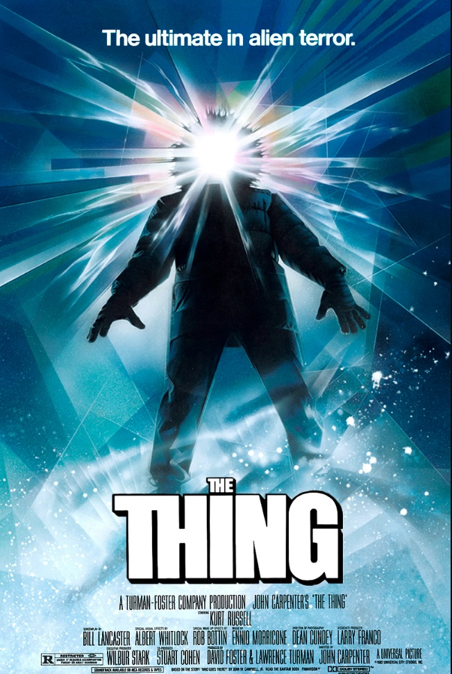

# FilmFolio

## General Overview

- FilmFolio is going to be a twist on the great movie tracking app known as Letterboxd.
- To begin, there will be three models on our backend database, Users, Movies, and Reviews.
- Users will have a first name, last name, email, password, and a watched section.
- Movies will have title, genre, year released, director, actors, average score out of five, photo url, and a has watched as a boolean.
- Finally, Reviews will have the username, title, body, and rating out of five.
- When loading up FilmFolio we will begin on the home scree, where users will be prompted to login.
- Once logged in, a row of five to six trending movies this week will be displayed. Under that a row of five to six movies you have in your watchlist will be displayed.
- When a user clicks on their profile, they will see their profile picture, username, total movies watched for the year, their four favorite movies, and four movies they recently watched.
- Most movies when not clicked on will be displayed in a verticle box with an image and average rating under them.
- There will also be a Films section. This section will contain various random films in our database. Search bar functionality will be crucial to filter through these.
- Finally a user can click on anymovie to get further information on it like: it's average rating, title, year released, director and actors. Along with reviews you and other users have given the movie.
- Full CRUD will be achieved in our review section where users can add, delete, and update reviews.

## Styling

- The plan is to keep FilmFolio similar to Letterboxd but with my own styling added to it.
- Letterboxd while a great app is filled with clutter and that is what FilmFolio will aim to get rid of.
- Keeping FilmFolio sleek but classy with some added features and flair will really make any movie lover want to use this app.

## Techonologies Used

- Backend: This will mainly be done in Django and Python.
- Frontend: The frontend will be done in React and Javascript.
- New Tech: I will be implementing Tailwind and Flowbite.

## ERD, Components, Trello and More

- A link to my Figma which contains the ERD, Component Heirarchy, and Wireframes can be found below.
  [Link to Figma](https://www.figma.com/file/WA7ecjdCToPswXgwySTOQv/FilmFolio?node-id=0%3A1&t=hqHwwNmn7rONQmmN-0)

- A link to my Trello can be found below.
  [Link to Trello](https://trello.com/b/8eG9umom/filmfolio)

## Credits

- I would like to give some credit to:
- Jack Viana
- Matt Sweeney
- Justin Harris
- For helping me through various design and implementation issues

- Firebase Auth
  [Link to firebase video](https://www.youtube.com/watch?v=zkz2HuNR_gk)

- Design for hover
  [Link for hover idea](https://codepen.io/t_afif/pen/rNJegrz)
